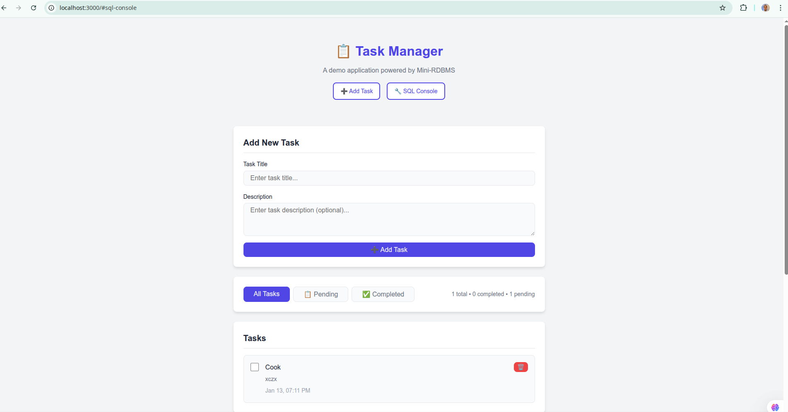
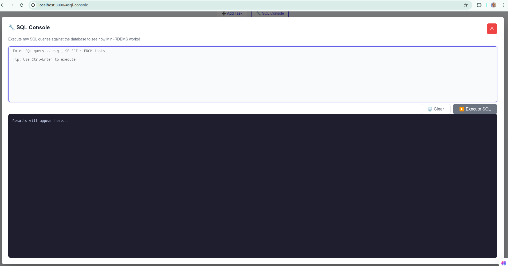
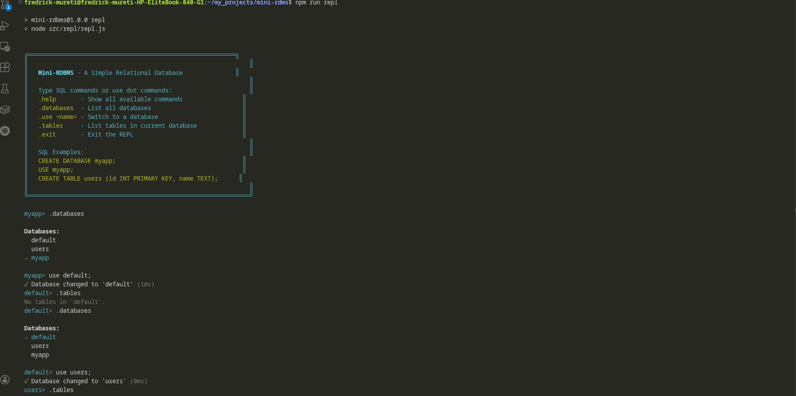
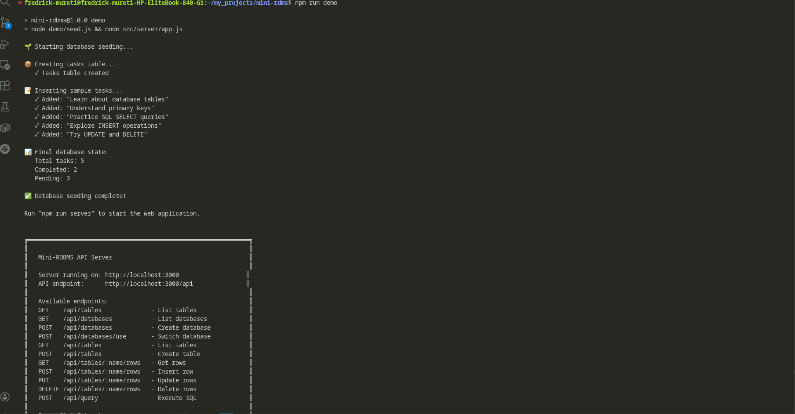

# Mini-RDBMS 🗄️

A **simple relational database management system** built from scratch in Node.js. This project is designed for **learning purposes**, demonstrating core database concepts like tables, columns, CRUD operations, indexing, constraints, and SQL parsing.

<p align="center">
  
</p>

---

## 📚 Table of Contents

- [Overview](#overview)
- [Screenshots](#screenshots)
- [Features](#features)
- [Project Structure](#project-structure)
- [Getting Started](#getting-started)
- [Architecture](#architecture)
- [Usage Guide](#usage-guide)
- [SQL Syntax Reference](#sql-syntax-reference)
- [API Reference](#api-reference)
- [Demo Web App](#demo-web-app)
- [Learning Path](#learning-path)

---

## 🎯 Overview

This mini-RDBMS implements fundamental database concepts:

```
┌─────────────────────────────────────────────────────────────┐
│                        MINI-RDBMS                           │
├─────────────────────────────────────────────────────────────┤
│  ┌─────────┐    ┌─────────┐    ┌──────────────────────────┐ │
│  │  REPL   │    │   API   │    │      Web Frontend        │ │
│  │ (CLI)   │    │(Express)│    │        (Demo)            │ │
│  └────┬────┘    └────┬────┘    └────────────┬─────────────┘ │
│       │              │                      │               │
│       └──────────────┼──────────────────────┘               │
│                      ▼                                      │
│            ┌─────────────────┐                              │
│            │  Query Engine   │  ← Executes parsed queries   │
│            └────────┬────────┘                              │
│                     ▼                                       │
│            ┌─────────────────┐                              │
│            │   SQL Parser    │  ← Parses SQL-like syntax    │
│            └────────┬────────┘                              │
│                     ▼                                       │
│  ┌──────────────────────────────────────────────────────┐   │
│  │              DATABASE MANAGER                        │   │
│  │  ┌────────────────────┐  ┌────────────────────┐      │   │
│  │  │    Database 1      │  │    Database 2      │  ... │   │
│  │  │  ┌───────┐┌──────┐ │  │  ┌───────┐┌──────┐ │      │   │
│  │  │  │Table A││TableB│ │  │  │Table X││TableY│ │      │   │
│  │  │  └───────┘└──────┘ │  │  └───────┘└──────┘ │      │   │
│  │  └────────────────────┘  └────────────────────┘      │   │
│  └──────────────────────────────────────────────────────┘   │
└─────────────────────────────────────────────────────────────┘
```

---

## 📸 Screenshots

### Web Interface - Task Manager
A full-featured task management application demonstrating CRUD operations.

<p align="center">
  
</p>

### SQL Console - Query Execution
Execute SQL queries directly in the browser with MySQL-style formatted output.

<p align="center">
  
</p>

<p align="center">
  
</p>

### Interactive REPL - Terminal Interface
Command-line interface for direct database interaction.

<p align="center">
  
</p>

<p align="center">
  
</p>

---

## ✨ Features

### Core Database Features
- ✅ **Database Management** - CREATE DATABASE, USE, DROP DATABASE
- ✅ **Table Management** - CREATE TABLE, DROP TABLE
- ✅ **Column Types** - INT, TEXT, BOOL
- ✅ **Constraints** - PRIMARY KEY, NOT NULL, UNIQUE
- ✅ **CRUD Operations** - INSERT, SELECT, UPDATE, DELETE
- ✅ **Basic Indexing** - Hash-based indexes for fast lookups
- ✅ **Joins** - INNER JOIN between tables
- ✅ **Data Persistence** - JSON file-based storage, data survives restarts

### Interface Options
- ✅ **Interactive REPL** - Command-line SQL interface with database context
- ✅ **REST API** - Express-based HTTP API
- ✅ **Web Demo** - Simple task manager application
- ✅ **Shared State** - GUI and REPL share the same data via persistence

---

## 📁 Project Structure

```
mini-rdbms/
│
├── index.js                 # Main entry point
├── package.json             # Project configuration
├── README.md               # This file
├── test.js                 # Test file
│
├── src/                    # Source code
│   │
│   ├── DatabaseManager.js  # Manages multiple databases
│   ├── database.js         # Single database container
│   │
│   ├── core/               # Core database components
│   │   ├── Column.js       # Column definition & validation
│   │   ├── Table.js        # Table with CRUD operations
│   │   └── Index.js        # Indexing for fast lookups
│   │
│   ├── parser/             # SQL parsing
│   │   └── SQLParser.js    # Parse SQL strings to AST
│   │
│   ├── engine/             # Query execution
│   │   └── QueryEngine.js  # Execute parsed queries
│   │
│   ├── persistence/        # Data persistence
│   │   └── Storage.js      # File-based data storage
│   │
│   ├── repl/               # Interactive interface
│   │   └── repl.js         # REPL implementation
│   │
│   └── server/             # Web API
│       ├── app.js          # Express server
│       └── routes/
│           └── api.js      # API routes
│
├── data/                   # Persisted database files (auto-created)
│   └── databases.json     # All databases, tables, and rows
│
├── demo/                   # Demo web application
│   ├── seed.js            # Seed data for demo
│   └── public/
│       ├── index.html     # Frontend HTML
│       ├── styles.css     # Styling
│       └── app.js         # Frontend JavaScript
│
└── docs/                   # Additional documentation
    └── LEARNING.md        # Learning guide
```

---

## 🚀 Getting Started

### Prerequisites
- Node.js >= 14.0.0

### Installation

```bash
# Clone or navigate to project
cd mini-rdbms

# Install dependencies
npm install

# Start the REPL
npm run repl

# Or start the web server
npm run server

# Or run the demo with sample data
npm run demo
```

---

## 🏗️ Architecture

### 1. Core Layer (`src/`)

The foundation of the database:

| Component | Responsibility |
|-----------|----------------|
| **DatabaseManager** | Manages multiple databases, handles CREATE/USE/DROP DATABASE |
| **Database** | Container for tables, provides cross-table operations (joins) |
| **Column** | Defines column metadata (name, type, constraints) and validates data |
| **Table** | Stores rows, enforces constraints, provides CRUD operations |
| **Index** | Hash-based indexing for O(1) lookups on indexed columns |

### 2. Parser Layer (`src/parser/`)

Converts SQL strings into structured objects (AST - Abstract Syntax Tree):

```javascript
// Input: "SELECT name, age FROM users WHERE age > 18"
// Output:
{
  type: 'SELECT',
  columns: ['name', 'age'],
  table: 'users',
  where: { column: 'age', operator: '>', value: 18 }
}
```

### 3. Engine Layer (`src/engine/`)

Executes parsed queries against the database:

```javascript
// Takes AST → Calls appropriate Database/Table methods → Returns results
```

### 4. Interface Layer (`src/repl/` & `src/server/`)

Two ways to interact with the database:
- **REPL**: Interactive command-line for direct SQL input
- **Server**: REST API for programmatic access

---

## 📖 Usage Guide

### REPL Mode

```bash
npm run repl
```

```sql
default> CREATE DATABASE myapp;
✓ Database 'myapp' created successfully

default> USE myapp;
✓ Database changed to 'myapp'

myapp> CREATE TABLE users (id INT PRIMARY KEY, name TEXT NOT NULL, active BOOL);
✓ Table 'users' created

myapp> INSERT INTO users VALUES (1, 'Alice', true);
✓ Inserted 1 row

myapp> SELECT * FROM users;
┌────┬───────┬────────┐
│ id │ name  │ active │
├────┼───────┼────────┤
│ 1  │ Alice │ true   │
└────┴───────┴────────┘

myapp> SHOW DATABASES;
┌────────────┐
│ Database   │
├────────────┤
│ default    │
│ myapp      │
└────────────┘

myapp> SHOW TABLES;
┌────────┐
│ Table  │
├────────┤
│ users  │
└────────┘

myapp> .databases
→ myapp
  default

myapp> .help
Available commands...

myapp> .exit
Goodbye!
```

### Programmatic Usage

```javascript
const { create, DatabaseManager, Database, Table, Column, QueryEngine } = require('mini-rdbms');

// Option 1: Using the factory function (recommended)
const { manager, engine } = create('myapp');

// Execute SQL commands
engine.execute('CREATE DATABASE blog');
engine.execute('USE blog');
engine.execute('CREATE TABLE posts (id INT PRIMARY KEY, title TEXT NOT NULL)');
engine.execute("INSERT INTO posts VALUES (1, 'Hello World')");
const results = engine.execute('SELECT * FROM posts');
console.log(results.data);

// Option 2: Using DatabaseManager directly
const manager2 = new DatabaseManager();
manager2.createDatabase('ecommerce');
manager2.use('ecommerce');

const engine2 = new QueryEngine(manager2);
engine2.execute('CREATE TABLE products (id INT PRIMARY KEY, name TEXT)');

// Option 3: Using Database directly (legacy, single database mode)
const db = new Database('simple');
const columns = [
  new Column('id', 'INT', { primaryKey: true }),
  new Column('name', 'TEXT', { notNull: true })
];
const usersTable = new Table('users', columns);
db.createTable('users', usersTable);
db.getTable('users').insert({ id: 1, name: 'Alice' });
```

---

## 📝 SQL Syntax Reference

### Database Commands

```sql
-- Create a new database
CREATE DATABASE database_name;
CREATE DATABASE IF NOT EXISTS database_name;

-- Switch to a database
USE database_name;

-- Delete a database
DROP DATABASE database_name;
DROP DATABASE IF EXISTS database_name;

-- List all databases
SHOW DATABASES;

-- List tables in current database
SHOW TABLES;
```

### CREATE TABLE
```sql
CREATE TABLE table_name (
  column1 TYPE [PRIMARY KEY] [NOT NULL] [UNIQUE],
  column2 TYPE,
  ...
);
```

**Supported Types:** `INT`, `TEXT`, `BOOL`

### INSERT
```sql
INSERT INTO table_name VALUES (value1, value2, ...);
INSERT INTO table_name (col1, col2) VALUES (val1, val2);
```

### SELECT
```sql
SELECT * FROM table_name;
SELECT col1, col2 FROM table_name;
SELECT * FROM table_name WHERE column = value;
SELECT * FROM table_name WHERE column > value;
```

### UPDATE
```sql
UPDATE table_name SET column = value WHERE condition;
```

### DELETE
```sql
DELETE FROM table_name WHERE condition;
```

### JOIN
```sql
SELECT * FROM table1 
JOIN table2 ON table1.col = table2.col;
```

### DROP TABLE
```sql
DROP TABLE table_name;
```

---

## 🌐 API Reference

Base URL: `http://localhost:3000/api`

### Database Endpoints

| Method | Endpoint | Description |
|--------|----------|-------------|
| GET | `/databases` | List all databases |
| POST | `/databases` | Create a new database |
| POST | `/databases/use` | Switch to a database |
| DELETE | `/databases/:name` | Drop a database |
| GET | `/databases/current` | Get current database info |

### Table Endpoints

| Method | Endpoint | Description |
|--------|----------|-------------|
| GET | `/tables` | List all tables |
| POST | `/tables` | Create a new table |
| DELETE | `/tables/:name` | Drop a table |
| GET | `/tables/:name/rows` | Get all rows |
| POST | `/tables/:name/rows` | Insert a row |
| PUT | `/tables/:name/rows` | Update rows |
| DELETE | `/tables/:name/rows` | Delete rows |

### Query Endpoints

| Method | Endpoint | Description |
|--------|----------|-------------|
| POST | `/query` | Execute raw SQL |
| GET | `/stats` | Get database statistics |

### Example API Usage

```bash
# List databases
curl http://localhost:3000/api/databases

# Create a database via SQL
curl -X POST http://localhost:3000/api/query \
  -H "Content-Type: application/json" \
  -d '{"sql": "CREATE DATABASE myapp"}'

# Switch database via SQL
curl -X POST http://localhost:3000/api/query \
  -H "Content-Type: application/json" \
  -d '{"sql": "USE myapp"}'

# Or use the dedicated endpoints
curl -X POST http://localhost:3000/api/databases \
  -H "Content-Type: application/json" \
  -d '{"name": "myapp"}'

curl -X POST http://localhost:3000/api/databases/use \
  -H "Content-Type: application/json" \
  -d '{"name": "myapp"}'

# Create table
curl -X POST http://localhost:3000/api/tables \
  -H "Content-Type: application/json" \
  -d '{"name": "users", "columns": [{"name": "id", "type": "INT", "primaryKey": true}]}'

# Insert row
curl -X POST http://localhost:3000/api/tables/users/rows \
  -H "Content-Type: application/json" \
  -d '{"id": 1, "name": "Alice"}'

# Get rows
curl http://localhost:3000/api/tables/users/rows
```

---

## 🎮 Demo Web App

A simple **Task Manager** demonstrating CRUD operations:

```bash
npm run demo
# Open http://localhost:3000 in your browser
```

Features:
- Add, view, edit, delete tasks
- Mark tasks as complete
- Filter by status

---

## � Data Persistence

The Mini-RDBMS automatically persists all data to disk, allowing data to survive restarts and be shared between the GUI and REPL.

### How It Works

- All database state is saved to `data/databases.json`
- Data is automatically saved after every modification (INSERT, UPDATE, DELETE, CREATE, DROP)
- On startup, the system loads existing data from disk
- Both the REPL and the server share the same data file

### Storage Structure

```
data/
└── databases.json     <- All databases, tables, and rows
```

### Configuration Options

```javascript
// Default: persistence enabled
const manager = new DatabaseManager();

// Disable persistence (in-memory only)
const manager = new DatabaseManager({ persist: false });

// Custom data directory
const manager = new DatabaseManager({ dataDir: './custom-path' });
```

### Workflow Example

1. Create a database and table via the Web GUI
2. Insert data through the SQL console
3. Stop the server
4. Start the REPL - your data is still there!
5. Query the data from the terminal

---

## �📚 Learning Path

If you're using this project to learn, here's a suggested order:

### Level 1: Core Concepts
1. **Column.js** - Understand data types and validation
2. **Table.js** - Learn how tables store and manage rows
3. **Database.js** - See how tables are organized

### Level 2: Advanced Features
4. **Index.js** - Understand indexing for performance
5. **Table.js (joins)** - Learn about joining tables

### Level 3: Parsing & Execution
6. **SQLParser.js** - See how SQL strings become structured data
7. **QueryEngine.js** - Understand query execution

### Level 4: Interfaces
8. **repl.js** - Build interactive CLIs
9. **app.js** - Build REST APIs

---

## 🤝 Contributing

Feel free to extend this project! Some ideas:
- Add more data types (FLOAT, DATE, etc.)
- Implement more SQL features (ORDER BY, GROUP BY, LIMIT)
- Add persistence (save to disk) ✅ *Implemented*
- Implement transactions
- Add more join types (LEFT, RIGHT, OUTER)

---

## 🙏 Acknowledgments

This project was built with the assistance of:
- **AI Tools (GitHub Copilot)** - Used for code suggestions, refactoring, and debugging assistance
- **Node.js Documentation** - For API references
- **Database Systems Concepts** - Inspired by Silberschatz, Korth & Sudarshan's textbook

The architecture, design decisions, and implementation logic are my own work. AI was used as a development tool to accelerate coding and help with syntax, similar to how one might use Stack Overflow or documentation.

---

## 📄 License

MIT License - Feel free to use this project for learning!

---

**Author:** [Fredrick Mureti](https://mureti.dev)  
**Repository:** [github.com/Fredrickmureti/mini-rdms](https://github.com/Fredrickmureti/mini-rdms)